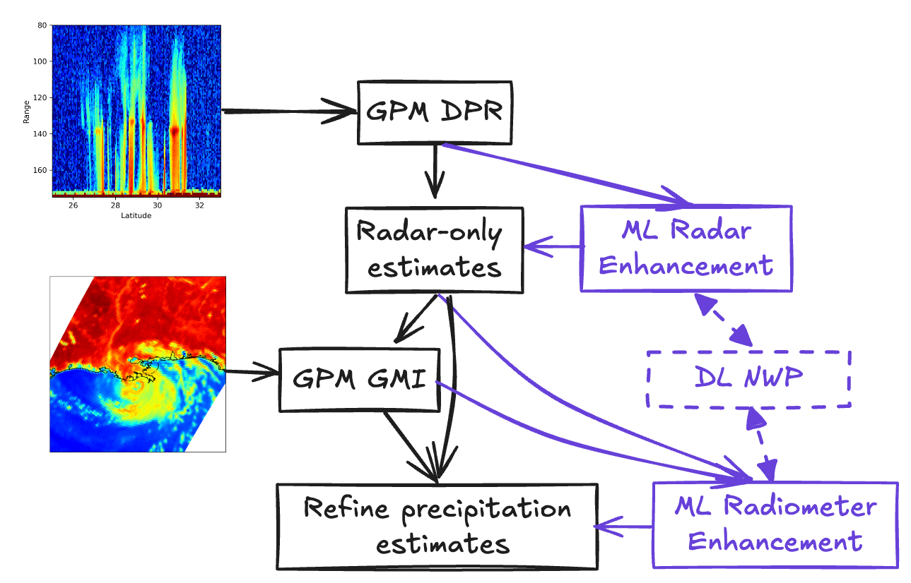
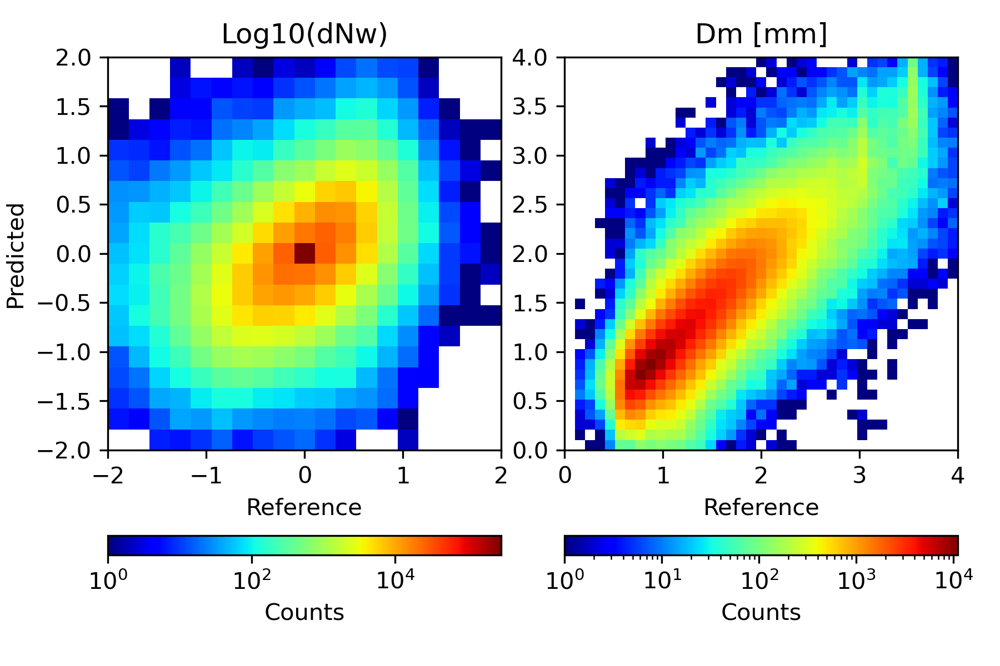
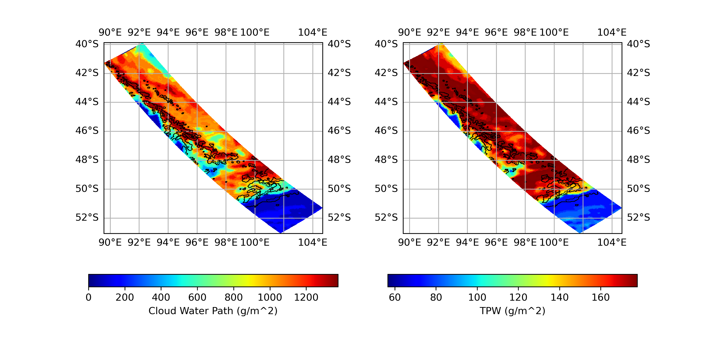

### A Machine-Learning Framework to Enhance, Adapt, and Extend the GPM Combined Radar-Radiometer Algorithm (CORRA)

Principal Investigator (PI) and Co-Investigator (Co-I)

#### 1 Scientific/Technical Management
#### 1.1 Executive Summary
Accurately quantifying uncertainties is critical to deriving optimal precipitation estimates from multiple information sources. This need has always existed but is now even more urgent as the number and diversity of data sources continue to expand rapidly. Recent developments, such as the deployment of miniaturized, cost-effective sensors (e.g., NASA's TROPICS constellation), alongside operational use of deep-learning-based numerical weather prediction models (e.g., FourCastNet, GraphCast), have underscored the need for robust methods to combine diverse information sources. Traditional satellite-based algorithms (from agencies such as NASA and NOAA) for precipitation estimation also contribute to the pressing need for enhanced data integration methods.

The NASA GPM Combined Radar-Radiometer Algorithm (CORRA) is a sophisticated algorithm that combines data from the GPM Dual-frequency Precipitation Radar (DPR) and the GPM Microwave Imager (GMI) to estimate precipitation. CORRA’s modular structure allows rigorous procedures to quantify uncertainties from each source of information [1]. Although CORRA has been refined over time, several limitations remain [2]. For instance, snowfall estimates are biased low relative to ground-based radar (e.g., MRMS) and the algorithm tends to miss light precipitation, particularly at high latitudes, due to limited radar sensitivity.

We propose developing two machine-learning (ML) modules to address CORRA's existing limitations and extend its capabilities for tasks like estimating precipitation from other instrument combinations and supporting data assimilation. The first module will employ Cluster-wise Ridge Regression (CRR) [4] to estimate precipitation rates, particle size distribution (PSD) parameters, and associated uncertainties from DPR-only observations. The radar CRR model will use a customized version of CORRA with an enhanced snowfall retrieval derived from field campaign microphysical observations. A key advantage of the radar CRR model is its computational efficiency relative to the current CORRA ensemble radar-profiling algorithm, with differentiable functions that allow precise uncertainty estimation.

The second module, also using CRR, will refine precipitation estimates and uncertainties from radiometer data. This model will be trained using synthetic brightness temperatures derived from the radar CRR output and CORRA’s surface emissivity estimates, via radiative transfer simulation. A biased sampling strategy, along with the CloudSat-GPM coincidence dataset [3], will support better representation of light precipitation profiles in training data, enabling improved estimates in both precipitation rates and uncertainties over current CORRA capabilities.

A schematic overview of the proposed research is provided in Figure 1.

**Figure 1. Schematic illustration of the proposed research. A radar Cluster-wise Ridge Regression (CRR) model will be trained using a customized CORRA with enhanced snowfall retrieval and incorporated to improve CORRA outputs. Additionally, a radiometer CRR model will be trained using synthetic data, enabling refined products and potential applications in deep-learning-based NWP data assimilation.*

#### 1.2 Technical Approach
#### 1.2.1 Radar Cluster-wise Ridge Regression
The GPM CORRA algorithm uses an ensemble filter for precipitation profile estimation [1]. A radar profiling algorithm [5] generates an ensemble of Ku-band radar-consistent precipitation profiles. This ensemble is then used to simulate Ka-band radar and GMI observations, which are iteratively updated, incorporating independent PIA estimates from the surface reference technique (SRT). The radar algorithm is run twice in the current CORRA version, using a PSD relationship between the intercept ($N_w$) and the mean diameter ($D_m$) [6]. Despite efforts to streamline the algorithm, it remains computationally intensive, making further refinement, alternative testing, or adaptation for missions like NASA AOS challenging.

To mitigate this, we propose implementing a more efficient, cluster-wise linear regression approach [4]. In this technique, predictors are grouped into clusters, and a linear regression model is estimated for each cluster. This approach, particularly effective for diverse applications like satellite-based cloud ice estimation [7], is stabilized by adding a ridge regression penalty to reduce overfitting. We refer to this method as Cluster-wise Ridge Regression (CRR). Due to its simplicity, CRR has been independently developed across research areas under various names, including conditional regression, cluster regression, and piece-wise linear regression. Conceptually, CRR is related to Gaussian Mixture Models [8], with crisp cluster boundaries, and may also be seen as a simplified neural network with activation paths corresponding to a unique cluster. CRRs can provide uncertainty estimates, unlike standard neural networks, making them suitable for our precipitation estimation task.

An anonymized description of the radar CRR model implementation is available in a GitHub repository: https://anonymous.4open.science/r/PMMCCST-397B/README.md. Our CRR approach uses the K-Means algorithm for clustering, with stratification by precipitation type (convective or stratiform) and surface type (land or ocean). Predictors in the radar CRR model include Ku-band radar reflectivity profiles and freezing level position, while dependent variables include PSD parameters ($N_w$, $D_m$), precipitation rates, and water content. Each cluster has a unique ridge regression of the form $Y = X\beta $ is derived, where $Y$ is the vector of dependent variables, $X$ is the matrix of predictors, and $\beta$ is the vector of coefficients. The coefficients are estimated using:

$$\hat{\beta} = (X^TX + \lambda I)^{-1}X^TY$$

where $\lambda$ is the regularization parameter chosen by cross-validation. For uncertainty, we calculate $\frac{1}{N-p} (Y-X\hat{\beta})^T(Y-X\hat{\beta})$, with $N$ as data points per cluster and $p$ as the size of $\hat{\beta}$.

Using this model, we derive $N_w$ ensembles by identifying the appropriate cluster, estimating $N_w$ using CRR, and sampling from the uncertainty distribution of that cluster. Estimates align with CORRA’s dual-frequency-based values, maintaining physical consistency across parameters. For instance, higher-than-average $N_w$ estimates are paired with lower $D_m$ values and reduced precipitation rates, consistent with the structurally imposed $N_w$-$D_m$ relationship[6].

An illustration comparing $N_w$ and $D_m$ estimates derived from the radar CRR model against CORRA V08 reference values is shown in Figure 2. The radar CRR model performs particularly well for $D_m$, despite using only Ku-band data, whereas CORRA V08 benefits from dual-frequency data.

*Figure 2: Comparison of $N_w$ and $D_m$ estimates derived from the radar CRR model and CORRA V08 references, showing strong consistency, especially for $D_m$.*

To address biases in ice-phase precipitation estimates, we will use a customized CORRA version where “a priori” $N_w$ for ice-phase PSDs is derived from dual-frequency reflectivity observations, based on microphysical data from the NASA IMPACTS field campaign [11]. Simulated Ku- and Ka-band observations are generated using the scattering calculations of [12]. A point-based CRR, offering uncertainty estimates, will provide $N_w$ values for this customized algorithm, which will generate the training data for the radar CRR module across precipitation types and surface conditions. We will use data only from 21 May 2018 onward to ensure dual-frequency coverage across the radar scan.

Ultimately, the radar CRR model will replace CORRA’s first computationally intense radar-profiling iteration, delivering rapid, bias-corrected $N_w$ ensembles. Full replacement of CORRA’s radar-profiling with a CRR-based approach could be explored post-V09, potentially benefiting NASA’s AOS and INCUS missions.

A detailed task list for radar CRR related activities is presented in Table 1.

| Proposed Activity| Benefits  | Timeline  |
|------------------|-----------|-----------|
|Customize CORRA to derive improved ice-phase PSD estimates from dual-frequency radar observations  | Ubiased precipitation estimates appropriate for the training of a radar CRR model| Feb 2025 - March 2025 |
| Develop Ku-band radar CRR model with uncertainty estimates | Fast generation of unbiased $N_w$ ensemble for CORRA V09 | March 2025 - April 2025 |
| Integration and testing of the Ku-band radar CRR model| Improved CORRA V09 products| April 2025 - December 2025 |
| Explore full replacement of CORRA’s radar-profiling with CRR-based approach | Potential benefits for NASA’s AOS and INCUS missions                     | 2026  |
| Extend the CRR approach to support DL NWP data assimilation| Enhanced capabilities for future and applications| 2027  |

#### 1.2.2 Radiometer Cluster-wise Ridge Regression

### 1.3 Impact

### 1.4 Relevance

### 1.5 Work Plan

### 1.6 Schedule

### 2. References

[1] Grecu, M., Olson, W.S., Munchak, S.J., Ringerud, S., Liao, L., Haddad, Z., Kelley, B.L. and McLaughlin, S.F., 2016. The GPM combined algorithm. Journal of Atmospheric and Oceanic Technology, 33(10), pp.2225-2245.

[2] Olson, W. S. and coauthors, 2024, PMM Combined Radar-Radiometer Algorithm, PMM Science Team Meeting, San-Diego, 9-13 September 2024, available https://docs.google.com/presentation/d/e/2PACX-1vSYTmdkLlcvAKa2lVka050RDLewQ-IQHa3mRU4-6Yqu3tM3TLAF_8IqtvnJCl6-JDs8XlevwtUaYsIo/pub?start=false&loop=false&delayms=3000

[3] Turk, F. Joseph, Sarah E. Ringerud, Andrea Camplani, Daniele Casella, Randy J. Chase, Ardeshir Ebtehaj, Jie Gong, Mark Kulie, Guosheng Liu, Lisa Milani, and et al. 2021. "Applications of a CloudSat-TRMM and CloudSat-GPM Satellite Coincidence Dataset" Remote Sensing 13, no. 12: 2264. https://doi.org/10.3390/rs13122264

[4] DeSarbo, W.S. and Cron, W.L., 1988. A maximum likelihood methodology for clusterwise linear regression. Journal of classification, 5, pp.249-282.

[5] Grecu, M., Tian, L., Olson, W.S. and Tanelli, S., 2011. A robust dual-frequency radar profiling algorithm. Journal of applied meteorology and climatology, 50(7), pp.1543-1557.

[6] Olson, W.S., Masunaga, H. and GPM CORRA Team., 2022. GPM combined radar-radiometer precipitation algorithm theoretical basis document (version 7). NASA: Washington, DC, USA, available at https://gpm.nasa.gov/sites/default/files/2023-01/Combined_algorithm_ATBD.V07_0.pdf.

[7] Grecu, M., and J. E. Yorks, 2024: Synergistic Retrievals of Ice in High Clouds from Elastic Backscatter Lidar, Ku-Band Radar, and Submillimeter Wave Radiometer Observations. J. Atmos. Oceanic Technol., 41, 79–93, https://doi.org/10.1175/JTECH-D-23-0028.1.

[8] Reynolds, D.A., 2009. Gaussian mixture models. Encyclopedia of biometrics, 741(659-663).

[9] Bishop, C.M. and Bishop, H., 2023. Deep learning: Foundations and concepts. Springer Nature.

[10] Ahmed, M., Seraj, R. and Islam, S.M.S., 2020. The k-means algorithm: A comprehensive survey and performance evaluation. Electronics, 9(8), p.1295.

[11] McMurdie, L.A., Heymsfield, G.M., Yorks, J.E., Braun, S.A., Skofronick-Jackson, G., Rauber, R.M., Yuter, S., Colle, B., McFarquhar, G.M., Poellot, M. and Novak, D.R., 2022. Chasing snowstorms: The investigation of microphysics and precipitation for Atlantic coast-threatening snowstorms (IMPACTS) campaign. Bulletin of the American Meteorological Society, 103(5), pp.E1243-E1269.

[12] Kuo, K.S., Olson, W.S., Johnson, B.T., Grecu, M., Tian, L., Clune, T.L., van Aartsen, B.H., Heymsfield, A.J., Liao, L. and Meneghini, R., 2016. The microwave radiative properties of falling snow derived from nonspherical ice particle models. Part I: An extensive database of simulated pristine crystals and aggregate particles, and their scattering properties. Journal of Applied Meteorology and Climatology, 55(3), pp.691-708.

[13] Chase, R. J., S. W. Nesbitt, and G. M. McFarquhar, 2021: A Dual-Frequency Radar Retrieval of Two Parameters of the Snowfall Particle Size Distribution Using a Neural Network. J. Appl. Meteor. Climatol., 60, 341–359, https://doi.org/10.1175/JAMC-D-20-0177.1.

### 3 Open Science and Data Management Plan
### 4 Biographical Sketches
### 5 Summary of Personnel and Work Effort
### 6 Current and Pending Support
### 7 Budget and Budget Justification
#### 7.1 Budget Justification Morgan State University
#### 7.2 Detailed Budget
#### 7.3 NASA Budget Justification: Narrative and Details
### 8 Special Notifications and/or Certifications